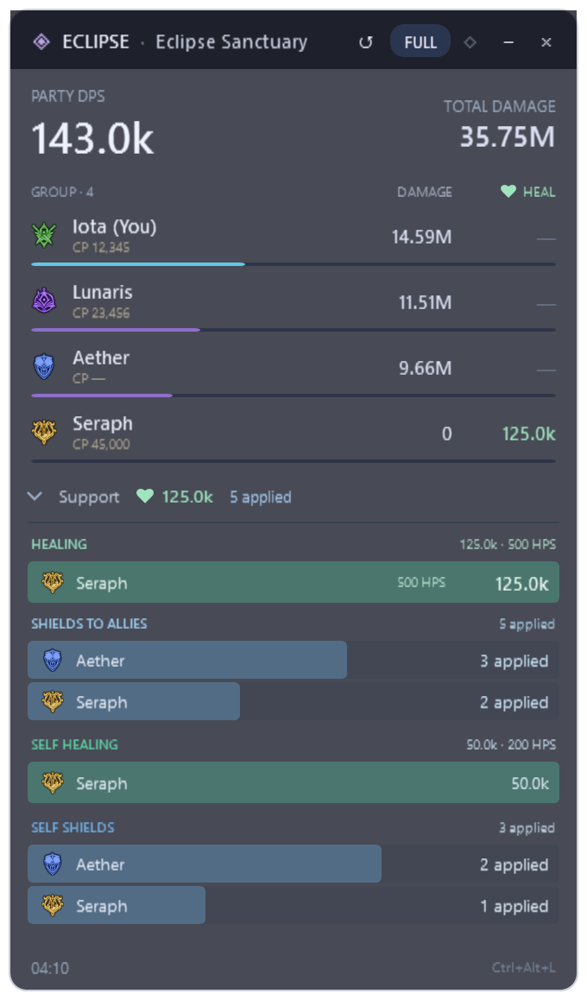

# Eclipse - Free AION 2 DPS Meter for Windows

**[Download Eclipse-Setup.exe](https://github.com/Iota-Nine/Aion2-Eclipse/releases/latest/download/Eclipse-Setup.exe)** · **[Official website](https://iota-nine.github.io/Aion2-Eclipse/)** · [Français](docs/README.fr.md)

**See your party's DPS while you play. Understand the whole run when you finish.**

Eclipse is a free AION 2 damage meter for Windows with a live party overlay and a full Glass desktop client. Follow damage, inspect skills, review dungeon runs and compare your builds in one place. Keep it on a second monitor, minimize it during the fight, then come back to your expedition summary.

**New in 3.0.8:** a cleaner adaptive compact HUD with real class icons and healing per player, **Alt+R** to reset counters while saving the interrupted run, the **V3 shortcut guide**, and boss bells that repeat until **STOP**. Automatic EU field-boss timers read the game map list and keep each server separate. Your Progression checklist, history and settings stay saved.

[Features](#a-clearer-view-of-every-fight) · [Install Eclipse](#install-eclipse) · [How the numbers work](#how-the-numbers-work) · [What's new](CHANGELOG.md) · [Report an issue](https://github.com/Iota-Nine/Aion2-Eclipse/issues/new/choose)

**Get started:** download **Eclipse-Setup.exe** or click **UPDATE** when offered in Eclipse. Open **Progression**, choose your character and tick completed activities. English is default; French is available in Preferences. No Eclipse account is required.

*Native screenshot of the released client. All gallery combat values are explicitly labelled demo data.*

## A clearer view of every fight

| Feature | What you get |
|---|---|
| **Live party DPS overlay** | Live party DPS returns to 0 after 2 seconds without received positive damage and starts a fresh DPS window on the next hit. Run totals and received player levels remain available. The HUD starts enabled and shares the client's measurements. |
| **Collapsible overlay** | Press **−** to keep only the draggable header, then **+** to restore compact/full counters. Measurements keep running. |
| **Return after Alt+Tab** | A visible HUD is automatically reordered above the game window when AION 2 regains focus. Position, dimensions, click-through and run totals stay intact; a deliberately hidden HUD stays hidden. |
| **HUD visibility shortcut** | **Alt+F8** shows/hides or reopens the HUD automatically. An occupied shortcut is reported; the client HUD button remains available. Standard Windows overlay; Steam and exclusive-fullscreen integration are not included. |
| **HUD mouse shortcut** | Press **Ctrl+Alt+L** to toggle click-through. The reminder is integrated into the HUD; no large recovery button. An occupied shortcut leaves the HUD clickable. |
| **Daily and weekly progression** | Your own checklist per character, permanent goals, custom counters and manual Gear Score. Hide completed tasks. Only identified recognized dungeon victories auto-complete; other activities are manual. Automatic resets require a schedule checked against the game. Optional visual ten-minute reminder; saved locally. |
| **V3 quick start and reset** | A silent V3 intro, shortcut tutorial with Close / Don’t show again, and a guide button in Preferences. Alt+R archives the interrupted run before resetting counters. |
| **Adaptive compact HUD** | Real class icons, aligned per-player healing, thinner damage bars and smaller rows for larger observed rosters. Scroll to every received member. Support details expand when needed; packet coverage is not universal. |
| **EU field-boss reminders** | Automatic timers from the in-game Field monsters list, with your EU server detected locally. Choose 10, 5 or 0 minutes and enable each boss alert. Reopen the game list for updates. Unknown times, names or channels are not guessed; no shared kill feed. |
| **Glass desktop client** | Translucent panels, animated AION artwork, Eclipse branding and an entirely silent startup intro. Move, resize or place the client on another monitor. |
| **Dungeon run correction** | Internal teleports preserve damage and the run. Supported final-boss deaths archive it and reset live totals; interruptions keep a recovered summary. 22 activity entries are recognized; automatic completion is limited to 7 dungeons. Other finishes remain manual. |
| **Party healing & HPS** | Healing aligned per player in Focus compact; full healing/HPS and expanded support details remain available. Skill/HoT and recipient analysis; zero-damage healers stay visible. Selected skills only; effective healing and overheal remain unknown. |
| **Shields, in detail** | Blue allied bars in compact/full. Selected skills across six classes; observed activations, received duration ranges and recipients. Group/companion notices are grouped. Shield capacity, absorbed damage and destruction remain unknown; duration is not actual uptime. |
| **Cleric and Chanter buffs** | Violet compact/full bars for eight selected beneficial skill families. Observed activations, received duration ranges, skills and recipients in analysis. Overlapping mantra/aura refreshes form one observed sequence. No invented uptime or damage gain. |
| **Self support, in detail** | Optional self-healing, self-shield and self-buff bars in compact/full. Self healing is already part of total healing; it is not counted twice. Recognized self-shield applications, without capacity or absorption. Off by default in Preferences. |
| **Party Combat Power** | CP beside each member in compact/full, when received from structured group information for the matching identity and server. Missing CP stays “—”. Can be disabled in Preferences. |
| **Party and skill analysis** | Inspect each member's damage, skill breakdown, critical hits, back attacks, maximum hits and received death counts. Nearby players outside the identified party are excluded. |
| **Expedition summary** | Total damage, duration, party contribution, burst windows, gaps between hits and target segments, together with the declared build used for that run. |
| **Interactive damage timeline** | Select a time range, inspect individual hits and find strong five-second burst windows. Large runs keep complete totals and mark partial timeline coverage when relevant. |
| **Run history** | Click a dungeon to open its analysis directly: every member’s total damage with thin contribution bars, followed by skills, hits and timeline. Back restores your filters and scroll. Local favourites, notes and interrupted runs remain available. |
| **A/B build comparisons** | Compare completed runs with matching target, region, declared difficulty and personal class. See observed DPS, critical-hit and back-attack changes. |
| **Personal build profiles** | Save class skill selections, notes, activity and region. Your run keeps a snapshot of the selected profile for later review. |
| **Dated class meta and community builds** | Refresh MetaRoad's contextual class rankings and links to community builds. Source, update date and regional uncertainty stay visible. Your own runs also form a separate local class ranking. |
| **Dedicated Rift timers** | Regional AION2Hub openings, fixed server clock and four future local/UTC times. Global/KR UTC+9; Taiwan UTC+8. Unknown travel portal durations stay unspecified. |
| **Rift reminders** | Favourite the Rift and enable its independent alert at 10 minutes before, 5 minutes before or opening. Region, favourite and timing are saved; reminders continue while minimized. |
| **Boss and event timers** | Regional AION2Hub calendar, corrected Kaira and executor times, Abyss events, Beritra and KR/TW PvP activities. Personal monster reminders and target segments remain available. |
| **Favourite boss alerts** | Star the event, enable **Notify me** and choose **10 minutes before**, **5 minutes before** or **at the scheduled time**. Reminders work while minimized and avoid duplicate alerts. |
| **English / Français** | English on first launch; switch client, overlay and setup labels to French. Your language choice is saved. |
| **Performance controls** | Adjust transparency, animation quality and always-on-top behaviour. Visual effects stop when minimized while capture, timers and saving continue. |
| **Exports and diagnostics** | Export run data and a share card; create a restricted diagnostic report for support. Logs and authentication tokens are excluded from that report. |
| **Guided setup and updates** | Included application runtime, automatic prerequisite check, official Npcap installation with consent when needed, shortcuts and verified in-app update downloads. |
| **Overlay and shutdown** | Close the overlay independently and reopen it from the client. Close the main client to finish pending saves and stop capture; minimize it to keep collecting. |

## Dedicated Rift timers

**Know the next opening in your local time.** Select your game service, star the Rift and enable its own reminder at 10, 5 or 0 minutes. The panel shows the fixed server clock and the next four local/UTC openings.

The bundled [AION2Hub timer](https://aion2hub.com/tools/event-timer) reference was checked on **3 October 2026**, replacing the previous sources and New York clock. Global EU/NA/SA/JP uses **UTC+9** with 00:00/03:00/06:00/09:00/12:00/15:00/18:00/21:00 server openings. KR uses **UTC+9** and TW **UTC+8**, both at 02:00/05:00/08:00/11:00/14:00/17:00/20:00/23:00 server time. Local daylight saving changes the display, never the server schedule.

Travel portal entry/lifetime is **not confirmed by this source**, so Eclipse no longer presents five-minute entry or one-hour event phases as established. Domination and Abyss Rift Zone have separate sourced activity durations and are KR/TW only. Regional [boss schedules](https://aion2hub.com/tools/world-bosses) are also corrected, including Kaira's interval and executor weekdays. Unverified matchmaking offsets have been removed. These are dated community schedules, not live spawn detections or official NCSOFT confirmation.

## Official website and bug reports

**[Open the Eclipse website](https://iota-nine.github.io/Aion2-Eclipse/)** for downloads, English/French features, client screenshots and optional ambient music. **Report a bug** in the client opens the private website form with your version filled in. Submitted fields are stored for support; JSON export is available. Combat logs and tokens are not uploaded automatically. GitHub Issues remain available for public discussions.

## Screenshots - English interface

The images below come from the native Windows application. Combat data is simulated for the gallery; no real player records are published.

### Compact Focus and V3 quick start

*Alt+F8 shows the HUD. Ctrl+Alt+L changes mouse interaction. Alt+R retains the interrupted run and resets counters. Screenshots use fictional/offline fixtures.*

### Your checklist between runs

*Choose your character, tick completed tasks and keep long-term goals. Gear Score is entered manually. [Checklist inspiration: GuideMMO](https://guidemmo.com/checklist-aion-2/). Reset schedules must be checked against your game.*

### Open a dungeon directly from history

### Healing, shields and support buffs in the live overlay

*Green: healing/HPS. Blue: observed shield activations and received lifetimes. Violet: selected Cleric/Chanter buffs. Available in compact and full. Fictional native demonstration data; received lifetime is not actual uptime.*

### Support skills and recipients

Support coverage currently includes eight healing families, six direct shield families and five specialization-dependent shield families. Conditional shields require their received specialization flag. Observed activations and received lifetimes do not measure actual uptime, shield capacity, blocked/absorbed damage or shield destruction. Eight selected Cleric/Chanter buff families are also tracked; overlapping aura refreshes are grouped. Missing packet formats or identities can limit observation; zero received events does not prove zero healing occurred. Export diagnostics in Preferences during an affected run.

### Party analysis

### Expedition summary

### Run history

### Builds and dated meta

### Boss and event reminders

### Overlay

## Install Eclipse

1. **[Download Eclipse-Setup.exe](https://github.com/Iota-Nine/Aion2-Eclipse/releases/latest/download/Eclipse-Setup.exe)** directly. The full application, images, game data and runtime are included.
2. **Run the installer** and choose English or French. No ZIP extraction is needed.
3. If Npcap is missing, setup downloads its official installer, asks for Windows permission and lets you accept the installation wizard. Eclipse continues when it finishes.
4. Open AION 2. If you were already in the world, teleport or change channels once to receive your character identity. Join or refresh your party after starting Eclipse.
5. The **overlay is enabled by default**. Use the desktop client on the same display or a second monitor. Open Preferences for French, transparency and performance settings.

Setup creates Desktop and Start menu shortcuts and installs Eclipse for your Windows account. The application runtime is included; no separate .NET installation is required. Internet is needed for downloads, external sources and updates. The download targets **Windows x64**; native interface checks were performed on Windows 11.

## Upgrade from V1 or V2

**UPDATE appears in the full client only when a newer version is detected, just like the overlay.** A luminous progress panel shows the real download percentage, then verification and installation preparation. **Click UPDATE in Eclipse to install Eclipse 3.0.1 in the same folder.** The executable name and public update channel stay compatible. Existing `data`, run history and HUD preferences are preserved. The updater verifies the release and checks the installed executable version before restarting it.

If an older updater keeps reopening V1, run **`Eclipse-Setup.exe`** once. The complete ZIP remains available in release assets for portable installation and in-app updates. V1 is superseded; historical release pages remain available. An already downloaded V1 executable does not disable itself remotely.

## How the numbers work

**Are these real damage values?** In normal mode, Eclipse uses damage events received from AION 2 network traffic. Demo mode is explicitly marked. Values that have not arrived remain unknown; player levels are shown only when received. Capture started late, missing packets or a changed game protocol can affect completeness.

**Why doesn't DPS reset every second?** DPS is a rate calculated from damage over a duration. The live HUD and live client use the current fight window, returning to zero after 2 seconds without received positive party damage. Archived summaries show the run average; the timeline and five-second burst view show short windows. Total damage accumulates until the run is ended or reset.

**Does it detect every dungeon name?** The catalogue recognizes 22 activities from received NPC identities. Internal teleports preserve an active dungeon run. Automatic completion is limited to verified final bosses in 7 dungeons; use **Finish run / Interrupt run** for other endings. Entering a different recognized activity archives an unfinished run as interrupted. Unknown activities remain measurable without a guessed name. Party queue changes alone do not erase combat.

**Is there an official AION API?** Combat capture uses local network packets through Npcap. Eclipse also exposes its own authenticated, loopback-only local API for local integrations; that is separate from an official game API. Meta and build sources are fetched over HTTPS.

**Will it work from another country?** Your physical location and interface language do not choose the game protocol. Windows configuration, network adapters and the AION 2 server/client version matter. Choose the appropriate source region in Preferences and use the connection page to diagnose capture. Compatibility is not guaranteed for every machine or future regional patch.

**Are boss timers live spawn detection?** They are dated AION2Hub scheduled reminders, converted to your local time. Choose the actual service: Global, Korea and Taiwan have different schedules. Favourite audio is optional; the intro stays silent.

**Is the class meta universal?** No. [MetaRoad's contextual tier list](https://metaroad.gg/aion2/getting-started/aion-2-class-tier-list-before-global-launch-best-classes-for-pve-pvp) and [community builds](https://metaroad.gg/aion2/community-builds) are dated community sources. The app refreshes them at launch and periodically, shows cached dates if unavailable and keeps regional uncertainty visible. Local rankings reflect only your saved runs, not all players.

## Feedback and project information

**Eclipse useful to your party?** Save the project with a GitHub star and share the [official download page](https://iota-nine.github.io/Aion2-Eclipse/) with your group. Bug reports and reproducible feedback help improve the next release.

Found a capture, update or interface problem? **[Open a bug report](https://github.com/Iota-Nine/Aion2-Eclipse/issues/new/choose)** with your Eclipse version, Windows version, game region and reproduction steps. Use the diagnostic export in Preferences and review what you share.

Eclipse is maintained by **Iota-Nine** as an independent AION 2 community project. This repository distributes prebuilt Windows releases and their documentation. Personal data, API tokens and local combat archives are not part of the public download.

AION, AION 2, NCSOFT artwork and game data belong to their respective owners. Eclipse is not affiliated with or endorsed by NCSOFT. Community packet-capture lineage and third-party components are acknowledged in the project; see [distribution terms](LICENSE).

## More detail in your HUD

*Native Windows display fixture with fictional characters and values. Self support is optional; unknown CP stays unknown.*
