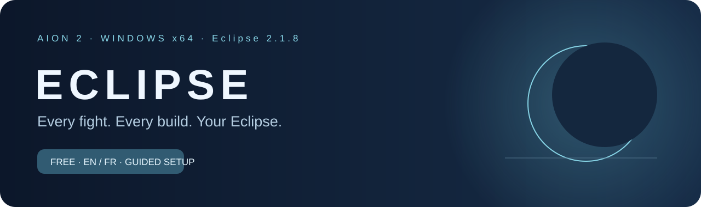
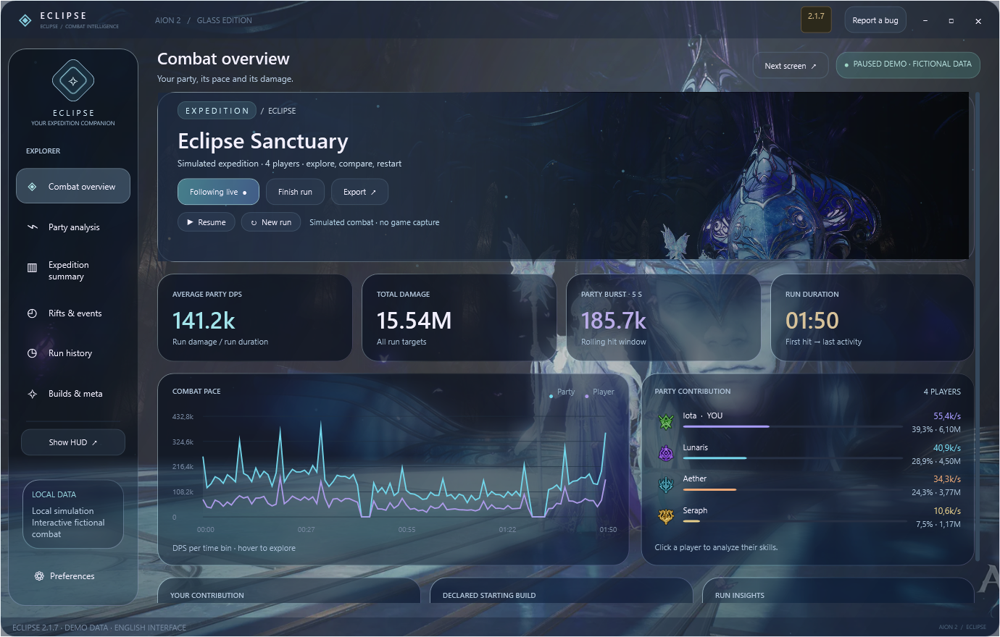
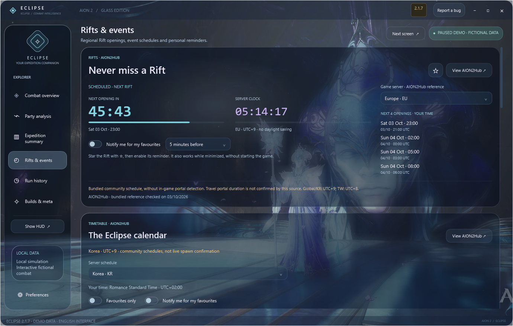
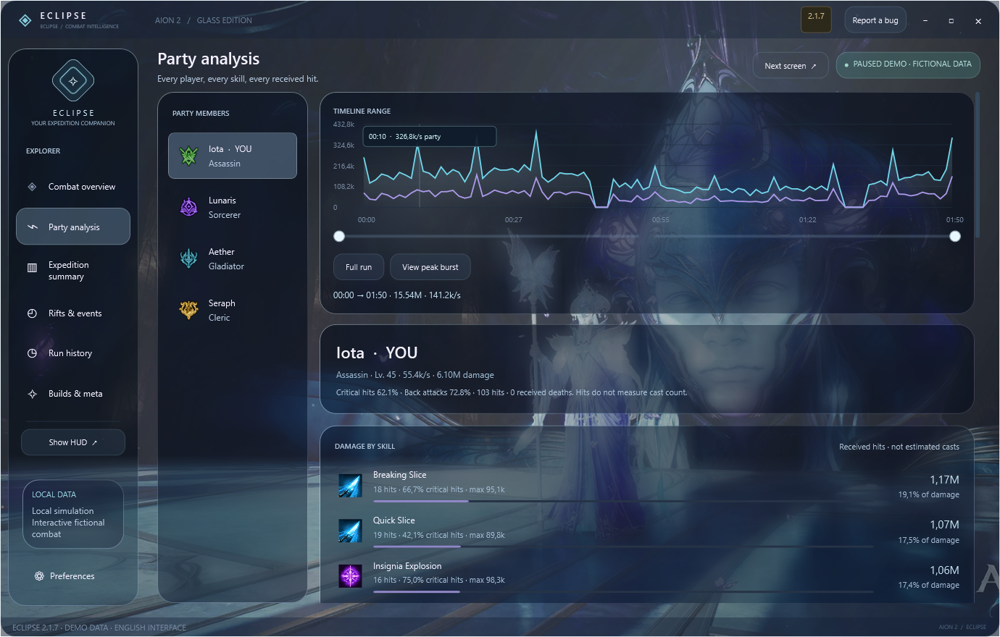
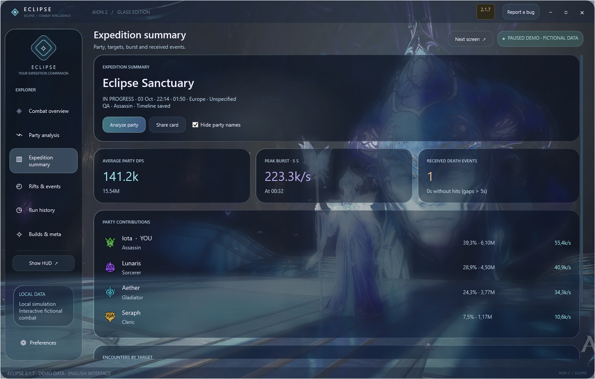
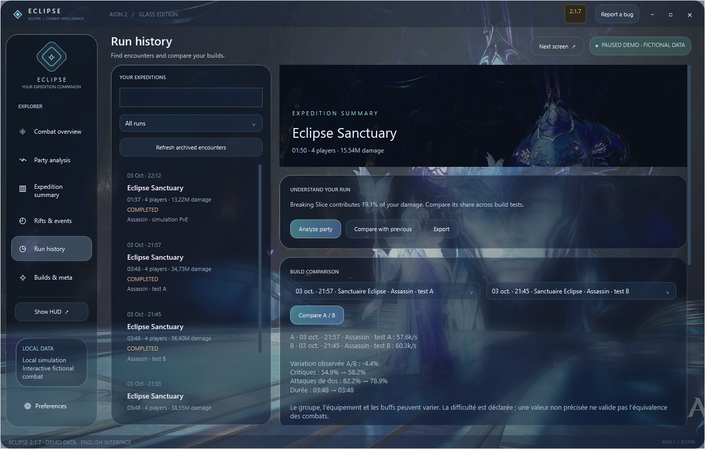
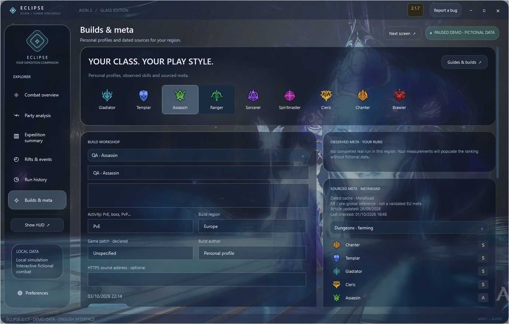
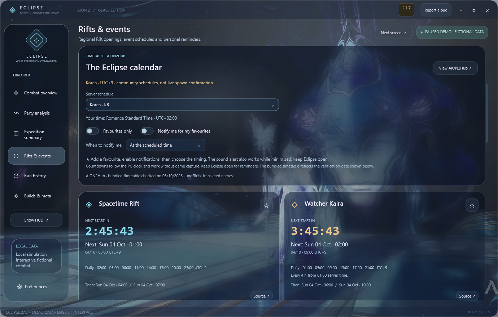
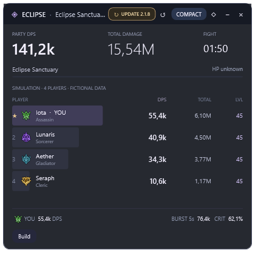

# Eclipse 2.1.7 — Compteur DPS AION 2 et analyse des combats

**Suis les DPS de ton groupe en combat. Comprends tout le run quand le donjon est terminé.**

Eclipse réunit un compteur de dégâts AION 2, un HUD et un grand client Windows à l'interface translucide. Regarde les compétences qui font la différence, conserve tes bilans et compare tes builds. Place le client sur un deuxième écran, réduis-le pendant le combat, puis retrouve ton résumé après le donjon.

**[Télécharger Eclipse 2.1.7](https://github.com/Iota-Nine/Aion2-Eclipse/releases/latest)** · [English](../README.md) · [Nouveautés](../CHANGELOG.md) · [Signaler un bug](https://github.com/Iota-Nine/Aion2-Eclipse/issues/new/choose)

**La Eclipse 2.1.7 est la mise à jour principale d'Eclipse et remplace la V1.** Depuis la V1, clique sur **UPDATE**. Les nouveaux utilisateurs téléchargent le même ZIP. La langue initiale est l'anglais ; le français se choisit dans Preferences. Aucun compte Eclipse ni inscription.

*Capture de l'application Windows publiée, avec des valeurs fictives signalées dans l'interface. Toutes les captures de présentation sont en anglais.*

## Toutes les fonctionnalités

| Fonction | Ce qu'elle apporte |
|---|---|
| **HUD DPS du groupe** | DPS observés, dégâts totaux, contribution et niveaux reçus. L'overlay démarre activé et partage les mesures du client. |
| **Client Glass** | Panneaux translucides, illustrations AION animées, identité Eclipse et intro silencieuse. Fenêtre déplaçable et redimensionnable, compatible avec un deuxième écran. |
| **Nouveau run à la téléportation** | Le paquet local reconnu clôt le précédent bilan et remet les compteurs à zéro avant les nouveaux dégâts. Le précédent run reste dans l'historique. |
| **Analyse du groupe et des compétences** | Dégâts de chaque joueur, poids des compétences, critiques, attaques de dos, coups maximums et morts reçues. Les attaquants proches hors du groupe identifié sont exclus. |
| **Bilan d'expédition** | Dégâts, durée, contribution, fenêtres de burst, périodes sans impacts, segments de cibles et contexte du build choisi. |
| **Courbe interactive** | Sélection d'une plage de temps, inspection des impacts et recherche de fenêtres fortes de cinq secondes. Les totaux restent complets lorsque la courbe est partielle. |
| **Historique local** | Recherche, filtres, favoris, notes, récupération des runs interrompus et durée de conservation réglable. |
| **Comparaison A/B** | Compare des runs terminés avec cible, région, difficulté déclarée et classe personnelle correspondantes. Observe les variations de DPS, critiques et attaques de dos. |
| **Profils de build** | Sélection des compétences, notes, activité et région. Chaque run conserve une copie du profil utilisé. |
| **Méta et builds communautaires** | Actualisation des classements contextuels et liens MetaRoad, avec date, source et incertitude régionale visibles. Classement local séparé d'après tes propres runs. |
| **Timer des failles** | Horaires régionaux AION2Hub, horloge fixe du serveur et quatre ouvertures locales/UTC. Global/KR UTC+9 ; Taïwan UTC+8. Durée inconnue du portail laissée indéterminée. |
| **Alertes de faille** | Favori + rappel indépendant à 10 min, 5 min ou à l’ouverture. Serveur et réglages mémorisés ; rappel actif en fenêtre réduite. |
| **Chronos de boss et d'événements** | Calendrier régional AION2Hub, horaires corrigés Kaira/exécuteurs, événement des Abysses, Beritra et PvP KR/TW. Rappels personnels conservés. |
| **Alertes de boss favoris** | Étoile + **Notify me**, puis choix entre **10 min avant**, **5 min avant** et **à l'heure prévue**. Fonctionne en fenêtre réduite, sans doublons. |
| **Anglais / Français** | Anglais à la première ouverture, français dans les réglages du client, du HUD et du setup. Choix mémorisé. |
| **Réglages de performance** | Transparence, qualité des animations et premier plan. Les effets s'arrêtent en fenêtre réduite ; capture, chronos et sauvegardes continuent. |
| **Exports et diagnostic** | Données du run, carte de partage et rapport de diagnostic limité, sans journaux ni jeton d'authentification. |
| **Setup et mises à jour** | Runtime inclus, prérequis vérifiés, installation officielle Npcap avec consentement si nécessaire, raccourcis et téléchargement UPDATE vérifié. |
| **Fermeture complète** | Réduire conserve la capture. La croix ferme le client, le HUD et le processus de capture. |

## Le nouveau timer des failles

Le panneau affiche la prochaine ouverture, l'horloge fixe du serveur et quatre horaires à ton heure locale / UTC. Choisis ton service, ajoute le favori et sélectionne le rappel 10, 5 ou 0 minutes. Aucun son n'est activé automatiquement.

Référence [AION2Hub](https://aion2hub.com/tools/event-timer), vérifiée le **3 octobre 2026**, en remplacement des anciens timers. Global EU/NA/SA/JP : **UTC+9**, à 00/03/06/09/12/15/18/21 h serveur. KR : **UTC+9** ; TW : **UTC+8**, à 02/05/08/11/14/17/20/23 h serveur. Le changement d'heure local ne modifie pas les horaires serveur.

La durée du portail de voyage n'est **pas confirmée par cette source** : les phases de 5 min d'entrée et 1 h d'événement sont retirées. Domination et Zone de faille des Abysses restent des activités distinctes, réservées KR/TW, avec leurs durées sourcées. Les [boss](https://aion2hub.com/tools/world-bosses) sont corrigés aussi : intervalle de Kaira, jours des exécuteurs et absence de décalage de matchmaking non confirmé. Calendrier communautaire daté, pas une détection réelle ni une confirmation officielle NCSOFT.

## Site officiel et rapports de bugs

**[Ouvrir le site Eclipse](https://eclipse-aion2-dps-meter.smart-bead-7533.chatgpt.site)** : téléchargement, présentation FR/EN, captures et musique d'ambiance facultative. **Report a bug** dans le client ouvre le formulaire privé avec ta version. Les champs envoyés sont enregistrés pour le dépannage et exportables en JSON. Aucun log de combat ni jeton n'est transmis automatiquement. GitHub Issues reste disponible pour les discussions publiques.

## Captures — interface anglaise

Les images viennent du client Windows natif et utilisent des données de démonstration. Aucun historique de joueur réel n'est publié.

## Installation

1. Dans la **[dernière release](https://github.com/Iota-Nine/Aion2-Eclipse/releases/latest)**, télécharge **`Aion2-Eclipse-v2.1.7-win-x64.zip`** dans Assets. Les archives « Source code » de GitHub ne contiennent pas l'application.
2. **Extrais tout le ZIP** dans un dossier de ton PC.
3. Lance **`Eclipse.Setup.exe`** et choisis la langue. Si Npcap manque, l'assistant télécharge son installateur officiel. Accepte la permission Windows et termine l'assistant Npcap ; Eclipse continue automatiquement.
4. Lance AION 2. Si tu étais déjà en jeu, téléporte-toi ou change de canal une fois. Rejoins ou actualise le groupe après avoir ouvert Eclipse.
5. **L'overlay est activé par défaut.** Déplace le grand client sur l'écran de ton choix. Dans Preferences, choisis Français, la transparence et la qualité des effets.

Le setup installe Eclipse pour ton compte Windows et crée les raccourcis Bureau et menu Démarrer. Le runtime est inclus : aucune installation .NET séparée. Internet est nécessaire pour les téléchargements, les sources externes et les mises à jour. Le paquet cible **Windows x64** ; l'interface native a été vérifiée sous Windows 11.

## Mise à jour depuis la V1 ou une V2 précédente

**UPDATE apparaît dans le client uniquement lorsqu'une version plus récente est détectée, comme dans l'overlay.** Une barre lumineuse indique le pourcentage réel du téléchargement, puis les étapes de vérification et de préparation. **UPDATE installe Eclipse 2.1.7 dans le même dossier.** Le nom de l'exécutable et le canal public restent compatibles. Le dossier `data` et les réglages du HUD sont conservés ; le client V2 y ajoute son historique. L'updater vérifie la release et la version réellement installée avant de relancer Eclipse.

Si un ancien updater boucle sur la V1, télécharge le dernier ZIP, extrais-le entièrement et lance **`Eclipse.Setup.exe`** une fois. La V1 est remplacée, mais les anciennes pages de release restent accessibles. Un ancien exécutable déjà téléchargé ne se désactive pas à distance.

## Mesures et sources

**Les dégâts sont-ils réels ?** En utilisation normale, Eclipse lit les événements de dégâts reçus dans le trafic AION 2. La démo est clairement signalée. Les niveaux non reçus restent inconnus. Une capture démarrée tard, des paquets manquants ou un changement de protocole peuvent affecter la complétude.

**Pourquoi le DPS ne revient pas à zéro chaque seconde ?** C'est un débit : dégâts divisés par une durée. Le HUD affiche la moyenne du combat courant ; le client affiche celle du run. La courbe et le burst de cinq secondes décrivent des fenêtres courtes. Les dégâts totaux s'accumulent jusqu'à la fin ou la remise à zéro du run.

**Tous les donjons sont-ils nommés automatiquement ?** Les frontières reposent sur le paquet local de téléportation / connexion reconnu, notamment pour les changements d'instance. Les autres téléportations remettent aussi le run à zéro. Il n'y a pas de base exhaustive des noms de donjons ; une transition sans ce paquet n'est pas garantie. Modifier une file de groupe ne clôt pas le combat.

**API ou réseau ?** La capture combat utilise les paquets locaux via Npcap. L'API locale authentifiée d'Eclipse sert aux intégrations sur ton PC ; ce n'est pas une API officielle du jeu. Les sources de méta et de builds sont consultées en HTTPS.

**Depuis un autre pays ?** Le pays et la langue de l'interface ne choisissent pas le protocole du jeu. Windows, les cartes réseau et la version du client / serveur AION 2 comptent. Choisis la bonne région de source et consulte le panneau de connexion. Eclipse ne garantit pas chaque PC ni chaque futur patch régional.

**Les chronos confirment-ils une apparition ?** Ce sont des rappels AION2Hub datés, convertis à ton heure locale. Choisis le vrai service : Global, KR et TW ont des horaires distincts. Seuls les favoris activés sonnent ; l'intro reste silencieuse.

**La méta est-elle universelle ?** Les [classements contextuels MetaRoad](https://metaroad.gg/aion2/getting-started/aion-2-class-tier-list-before-global-launch-best-classes-for-pve-pvp) et les [builds communautaires](https://metaroad.gg/aion2/community-builds) sont des sources datées. L'app les actualise au démarrage et périodiquement, affiche le cache daté si elles sont indisponibles et signale l'incertitude régionale. Le classement local représente uniquement tes runs sauvegardés.

## Retours et projet

**[Signale un bug](https://github.com/Iota-Nine/Aion2-Eclipse/issues/new/choose)** avec la version Eclipse, Windows, la région du jeu et les étapes du problème. Tu peux générer un diagnostic depuis Preferences et vérifier ce que tu partages.

Eclipse est maintenu par **Iota-Nine**, comme projet communautaire indépendant. Ce dépôt distribue les releases Windows compilées et leur documentation. Les données personnelles, jetons API et archives de combat locales sont exclus du téléchargement public.

AION, AION 2, les illustrations NCSOFT et les données du jeu appartiennent à leurs ayants droit. Eclipse n'est pas affilié à NCSOFT. Voir les [conditions de distribution](../LICENSE).
