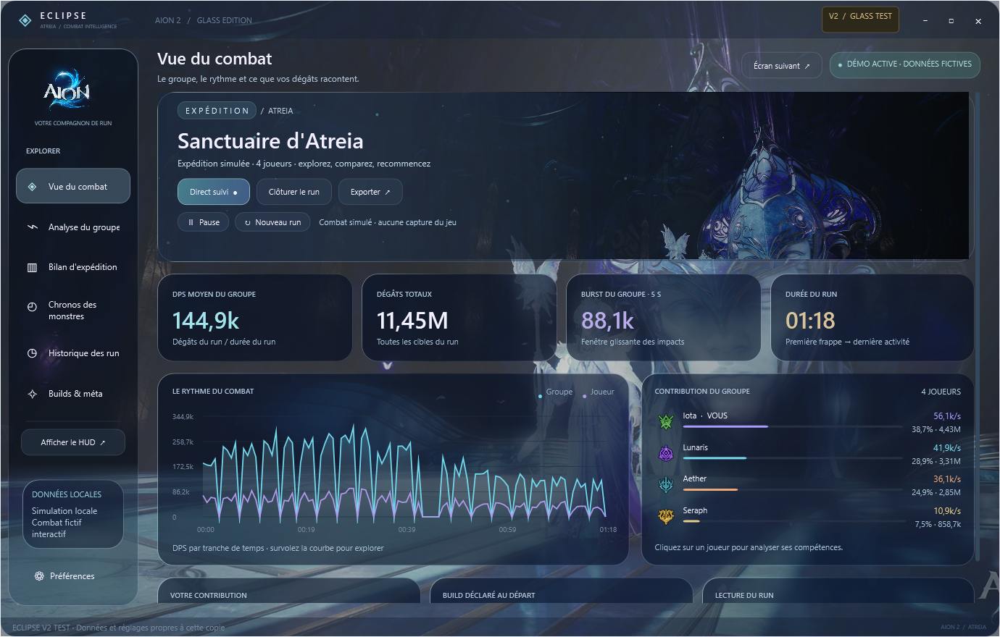
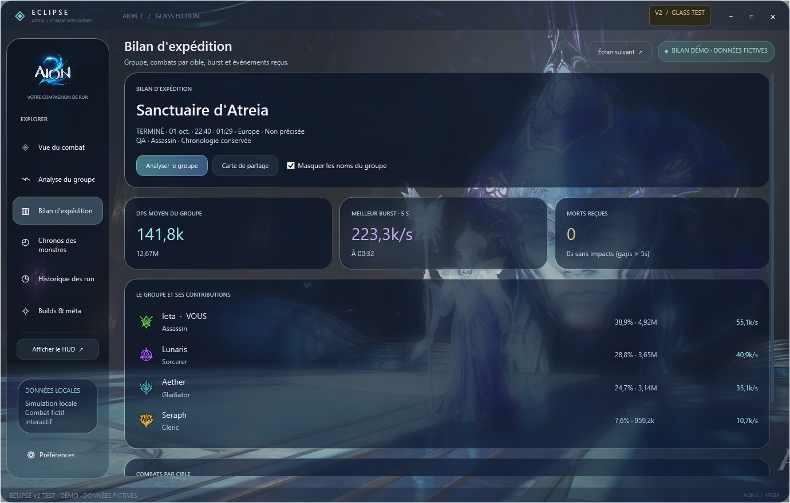

# Eclipse — compteur DPS AION 2 gratuit pour Windows

**Eclipse affiche les DPS du groupe, les dégâts reçus, les niveaux des joueurs et un HUD déplaçable pour AION 2.** Gratuit pour un usage personnel, sans compte ni inscription.

**[Télécharger Eclipse](https://github.com/Iota-Nine/Aion2-Eclipse/releases/latest)** · [English](../README.md) · [Nouveautés](../CHANGELOG.md) · [Signaler un bug](https://github.com/Iota-Nine/Aion2-Eclipse/issues/new/choose)

## Installation

1. Télécharge le fichier **`Aion2-Eclipse-…-win-x64.zip`** dans la dernière release. Ne prends pas « Source code ».
2. Extrais **tout le ZIP** dans un dossier accessible en écriture, par exemple Documents.
3. Lance **`Eclipse.Setup.exe`**.
4. Accepte la demande Windows. Si Npcap manque, le setup télécharge et ouvre son installateur officiel : lis et accepte son assistant.
5. Entre dans AION 2 et utilise une compétence. Si tu étais déjà en jeu, téléporte-toi ou change de canal une fois. Rejoins le groupe après avoir démarré Eclipse pour recevoir ses informations.

Le setup crée les raccourcis Bureau et menu Démarrer et installe Eclipse dans ton compte Windows. Le runtime .NET est inclus. Internet est nécessaire pour télécharger Npcap s'il manque. Windows 11 x64 est recommandé.

## Fonctions de la version publique

- DPS moyens du groupe et dégâts de combat, cumulés entre les cibles jusqu'au reset.
- Niveaux des joueurs lorsque leurs informations sont reçues ; les valeurs manquantes restent inconnues.
- HUD déplaçable et mode laissant passer les clics.
- Setup guidé et détection des prérequis.
- Mise à jour intégrée avec vérification du téléchargement et récupération des erreurs.
- Fermeture du client, du HUD et de la capture.

## Mise à jour et fermeture corrigées en v1.0.30

La v1.0.30 corrige UPDATE qui ferme puis rouvre l'ancienne version, ainsi que la croix laissant Eclipse en arrière-plan. Elle gère mieux les fichiers verrouillés et conserve les détails d'échec. [Notes de release](https://github.com/Iota-Nine/Aion2-Eclipse/releases/tag/v1.0.30).

Si une ancienne version reste bloquée, ferme Eclipse, télécharge et extrais le dernier ZIP, puis lance **`Eclipse.Setup.exe` une fois** pour remplacer l'ancien outil de mise à jour. Ensuite, utilise UPDATE normalement.

## Raccourcis

| Action | Raccourci |
|---|---|
| Afficher / masquer le HUD | `Ctrl+Shift+H` |
| Laisser passer les clics | `Ctrl+Shift+L` |
| Réinitialiser le combat | `Ctrl+Shift+R` |

## Comprendre les valeurs

Les données de combat viennent des événements réseau reçus localement, pas d'une API officielle de combat NCSOFT. L'API locale d'Eclipse donne accès à l'état calculé par Eclipse.

Les DPS du combat sont **les dégâts totaux reçus divisés par la durée du combat**. Ils ne repartent donc pas à zéro chaque seconde. Des paquets manquants, une identité incomplète ou un changement du protocole du jeu peuvent limiter la couverture. Le classement DPS ne résume pas la qualité des soins, du tanking ou du soutien.

Le logiciel n'impose pas de restriction de pays ou de langue Windows. Sa compatibilité dépend du client AION 2, du pilote de capture et du PC ; toutes les régions et configurations n'ont pas été validées.

## V2 en préparation

Une copie séparée est en test : client translucide pour deuxième écran, bilan d'expédition, compétences et cibles, sélection d'une plage de temps, comparaison A/B, favoris et notes, profils de builds, sources méta datées, réglages de performance et chronos de monstres.

**La V2 n'est pas dans le ZIP public v1.0.30.** Les rappels de respawn reposent sur un délai déclaré et un serveur/canal ; ils ne garantissent pas un horaire officiel. Les démos utilisent des valeurs fictives, et une source méta KR n'est pas présentée comme une méta européenne validée.

Captures du prototype, distinct du client v1 distribué. Visuels AION 2 : NCSOFT, issus du site officiel du jeu.

## Aide

Pour un souci de Npcap, relance le setup et termine son assistant. Pour une identité ou un groupe manquant, démarre Eclipse avant d'entrer dans le monde, téléporte-toi et rejoins le groupe.

[Signale un bug](https://github.com/Iota-Nine/Aion2-Eclipse/issues/new/choose) avec la version Eclipse, la version Windows, la région du jeu et les étapes permettant de reproduire le problème. Ne partage pas de jeton API ni d'identifiant de compte.

Le dépôt distribue les exécutables précompilés ; le code source de l'application n'y est pas publié. [Conditions de distribution](../LICENSE). Projet communautaire indépendant, sans affiliation avec NCSOFT. AION 2 et ses visuels appartiennent à leurs titulaires respectifs.
