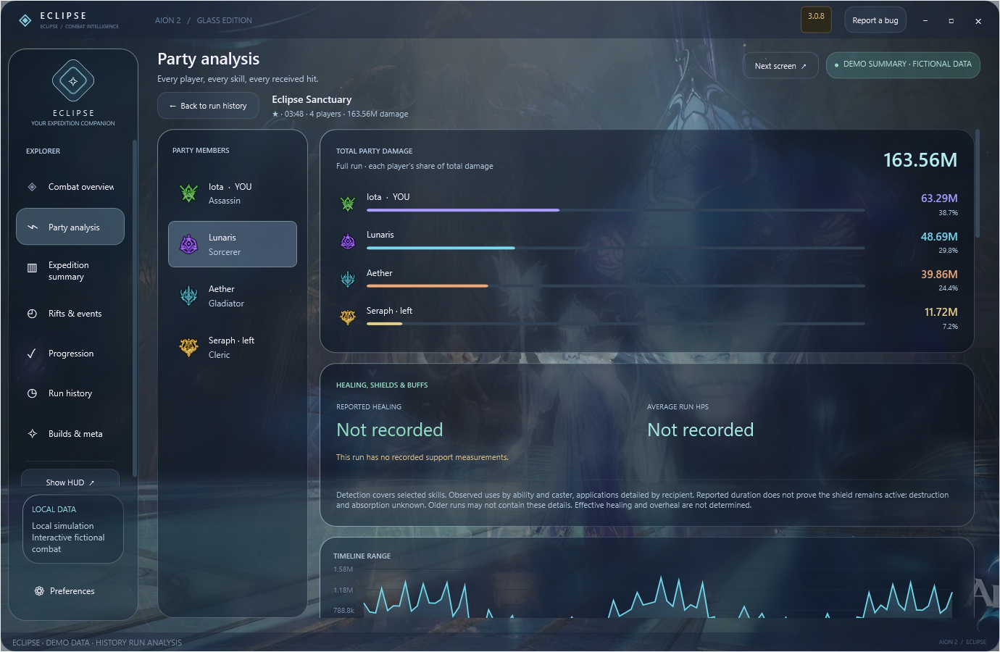
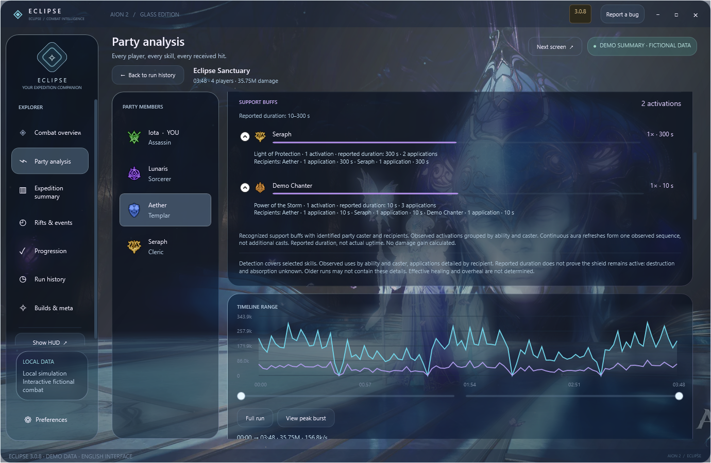
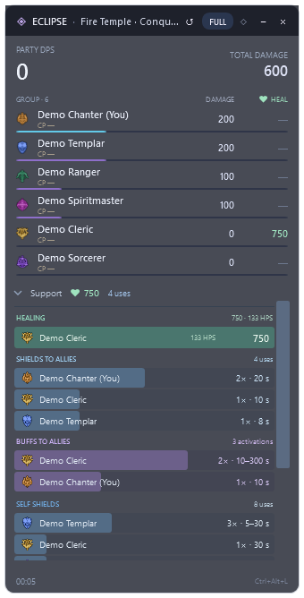
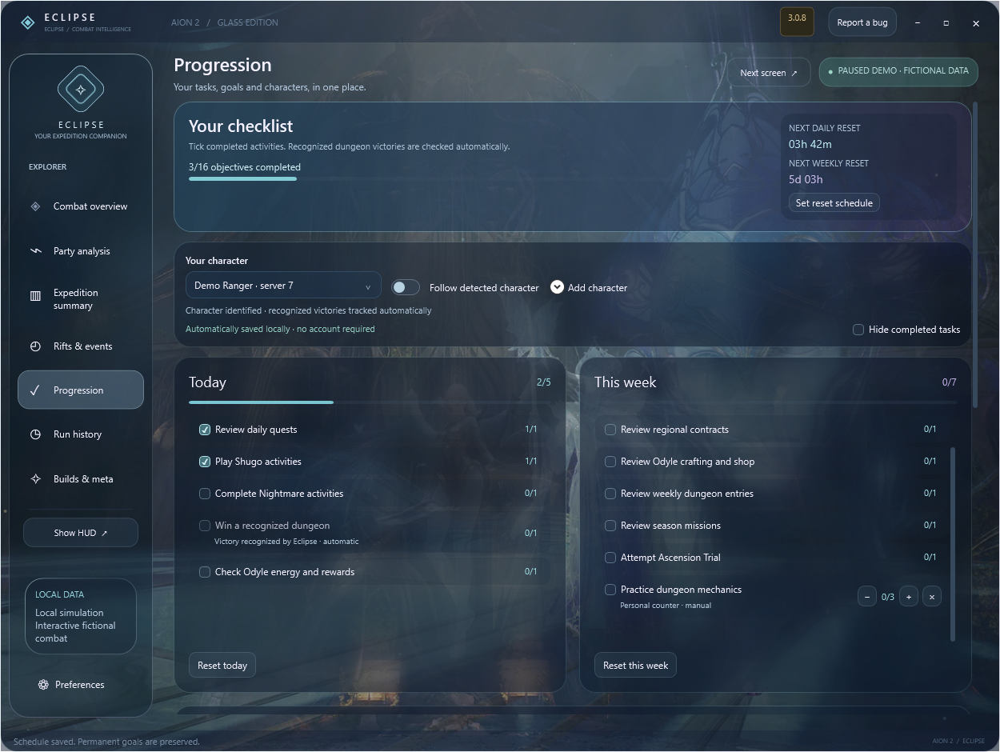
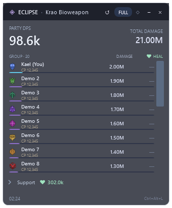
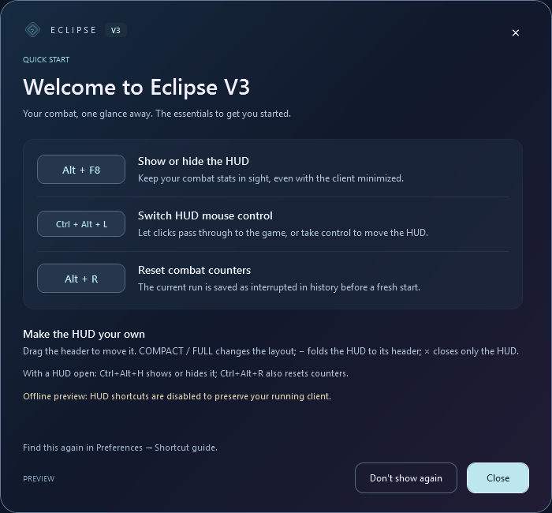

# Eclipse - DPS meter AION 2 gratuit pour Windows

**Nouveau en 3.0.8 :** HUD compact adaptatif avec icônes de classe et soins par joueur, **Alt+R** pour conserver le run interrompu puis remettre les compteurs à zéro, **guide V3**, et cloche jusqu’à **STOP**. Timers de boss de terrain synchronisés automatiquement depuis la liste du jeu, distincts par serveur EU. Historique, progression et réglages conservés.

**[Télécharger Eclipse-Setup.exe](https://github.com/Iota-Nine/Aion2-Eclipse/releases/latest/download/Eclipse-Setup.exe)** · **[Site officiel en français](https://iota-nine.github.io/Aion2-Eclipse/fr/)** · [English](../README.md)

**Suis les DPS de ton groupe en combat. Comprends tout le run quand le donjon est terminé.**

Eclipse réunit un compteur de dégâts AION 2, un HUD et un grand client Windows à l'interface translucide. Regarde les compétences qui font la différence, conserve tes bilans et compare tes builds. Place le client sur un deuxième écran, réduis-le pendant le combat, puis retrouve ton résumé après le donjon.

[Fonctionnalités](#toutes-les-fonctionnalités) · [Installation](#installation) · [Mesures et sources](#mesures-et-sources) · [Nouveautés](../CHANGELOG.md) · [Signaler un bug](https://github.com/Iota-Nine/Aion2-Eclipse/issues/new/choose)

**Pour commencer :** télécharge **Eclipse-Setup.exe** ou clique sur **UPDATE** lorsqu’il est proposé. Ouvre **Progression**, choisis ton personnage et coche tes activités terminées. L’anglais est la langue initiale ; le français se choisit dans Preferences. Aucun compte Eclipse requis.

*Capture de l'application Windows publiée, avec des valeurs fictives signalées dans l'interface. Toutes les captures de présentation sont en anglais.*

## Toutes les fonctionnalités

| Fonction | Ce qu'elle apporte |
|---|---|
| **Soins du groupe et HPS** | Barres vertes sous les dégâts du HUD compact et complet, soins reçus, parts des soigneurs, HPS moyens, compétences/ticks et destinataires. Le joueur local peut être DPS ou tank ; les healers à zéro dégât restent visibles. Soins effectifs et overheal inconnus. |
| **Boucliers en détail** | Barres bleues en compact/complet. Compétences sélectionnées sur six classes, activations observées, plages de durées reçues et destinataires. Notifications regroupées. PV, absorption et destruction inconnus ; la durée reçue ne mesure pas l’uptime réel. |
| **Buffs du Cleric et de l’aède** | Barres violettes pour huit familles bénéfiques sélectionnées. Activations observées, durées reçues et détails par compétence/destinataire. Rafraîchissements de mantras regroupés ; aucun uptime ou gain de dégâts inventé. |
| **HUD DPS du groupe** | Le DPS live revient à 0 après 2 secondes sans dégâts positifs reçus et repart sur une nouvelle fenêtre au prochain impact. Les dégâts cumulés et les niveaux reçus restent disponibles. L'overlay démarre activé et partage les mesures du client. |
| **Retour après Alt+Tab** | Le HUD visible revient devant lorsque AION 2 reprend le focus. Position, dimensions, clics et cumuls restent intacts ; un HUD masqué volontairement reste masqué. |
| **Affichage du HUD** | **Alt+F8** affiche, masque ou rouvre l'overlay automatiquement. Un conflit de raccourci est signalé ; le bouton HUD du client reste disponible. Overlay Windows habituel, sans intégration Steam ou plein écran exclusif. |
| **Raccourci souris du HUD** | **Ctrl+Alt+L** active ou désactive le passage des clics. Rappel discret intégré, gros bouton supprimé. Si le raccourci est occupé, le HUD reste cliquable. |
| **Checklist de progression** | Tâches quotidiennes et hebdomadaires par personnage, objectifs permanents, compteurs personnalisés et Gear Score manuel. Filtre des tâches terminées. Seules les victoires reconnues et identifiées sont automatiques. Reset activé après vérification des horaires dans le jeu, rappel visuel facultatif à 10 min et sauvegarde locale. |
| **Client Glass** | Panneaux translucides, illustrations AION animées, identité Eclipse et intro silencieuse. Fenêtre déplaçable et redimensionnable, compatible avec un deuxième écran. |
| **Comptage du donjon corrigé** | Les TP internes conservent le run. Une mort de boss final prise en charge archive le bilan et remet les totaux live à zéro ; les interruptions conservent un bilan récupéré. 22 activités reconnues, fin automatique limitée à 7 donjons. Les autres fins restent manuelles. |
| **Analyse du groupe et des compétences** | Dégâts de chaque joueur, poids des compétences, critiques, attaques de dos, coups maximums et morts reçues. Les attaquants proches hors du groupe identifié sont exclus. |
| **Bilan d'expédition** | Dégâts, durée, contribution, fenêtres de burst, périodes sans impacts, segments de cibles et contexte du build choisi. |
| **Courbe interactive** | Sélection d'une plage de temps, inspection des impacts et recherche de fenêtres fortes de cinq secondes. Les totaux restent complets lorsque la courbe est partielle. |
| **Historique local** | Cliquer un donjon ouvre son analyse : dégâts totaux de tous les membres, fines barres de contribution, puis détails et chronologie. Retour conserve filtres et défilement. Favoris, notes et récupération des runs interrompus restent disponibles. |
| **Comparaison A/B** | Compare des runs terminés avec cible, région, difficulté déclarée et classe personnelle correspondantes. Observe les variations de DPS, critiques et attaques de dos. |
| **Profils de build** | Sélection des compétences, notes, activité et région. Chaque run conserve une copie du profil utilisé. |
| **Méta et builds communautaires** | Actualisation des classements contextuels et liens MetaRoad, avec date, source et incertitude régionale visibles. Classement local séparé d'après tes propres runs. |
| **Timer des failles** | Horaires régionaux AION2Hub, horloge fixe du serveur et quatre ouvertures locales/UTC. Global/KR UTC+9 ; Taïwan UTC+8. Durée inconnue du portail laissée indéterminée. |
| **Alertes de faille** | Favori + rappel indépendant à 10 min, 5 min ou à l’ouverture. Serveur et réglages mémorisés ; rappel actif en fenêtre réduite. |
| **Chronos de boss et d'événements** | Calendrier régional AION2Hub, horaires corrigés Kaira/exécuteurs, événement des Abysses, Beritra et PvP KR/TW. Rappels personnels conservés. |
| **Alertes de boss favoris** | Étoile + **Notify me**, puis choix entre **10 min avant**, **5 min avant** et **à l'heure prévue**. Fonctionne en fenêtre réduite, sans doublons. |
| **Anglais / Français** | Anglais à la première ouverture, français dans les réglages du client, du HUD et du setup. Choix mémorisé. |
| **Réglages de performance** | Transparence, qualité des animations et premier plan. Les effets s'arrêtent en fenêtre réduite ; capture, chronos et sauvegardes continuent. |
| **Exports et diagnostic** | Données du run, carte de partage et rapport de diagnostic limité, sans journaux ni jeton d'authentification. |
| **Setup et mises à jour** | Runtime inclus, prérequis vérifiés, installation officielle Npcap avec consentement si nécessaire, raccourcis et téléchargement UPDATE vérifié. |
| **Overlay et fermeture** | Fermer l’overlay laisse le client et la capture actifs ; son bouton le rouvre. Fermer le client termine les sauvegardes et arrête la capture. Réduire continue de mesurer. |

## Le nouveau timer des failles

Le panneau affiche la prochaine ouverture, l'horloge fixe du serveur et quatre horaires à ton heure locale / UTC. Choisis ton service, ajoute le favori et sélectionne le rappel 10, 5 ou 0 minutes. Aucun son n'est activé automatiquement.

Référence [AION2Hub](https://aion2hub.com/tools/event-timer), vérifiée le **3 octobre 2026**, en remplacement des anciens timers. Global EU/NA/SA/JP : **UTC+9**, à 00/03/06/09/12/15/18/21 h serveur. KR : **UTC+9** ; TW : **UTC+8**, à 02/05/08/11/14/17/20/23 h serveur. Le changement d'heure local ne modifie pas les horaires serveur.

La durée du portail de voyage n'est **pas confirmée par cette source** : les phases de 5 min d'entrée et 1 h d'événement sont retirées. Domination et Zone de faille des Abysses restent des activités distinctes, réservées KR/TW, avec leurs durées sourcées. Les [boss](https://aion2hub.com/tools/world-bosses) sont corrigés aussi : intervalle de Kaira, jours des exécuteurs et absence de décalage de matchmaking non confirmé. Calendrier communautaire daté, pas une détection réelle ni une confirmation officielle NCSOFT.

## Site officiel et rapports de bugs

**[Ouvrir le site Eclipse](https://iota-nine.github.io/Aion2-Eclipse/)** : téléchargement, présentation FR/EN, captures et musique d'ambiance facultative. **Report a bug** dans le client ouvre le formulaire privé avec ta version. Les champs envoyés sont enregistrés pour le dépannage et exportables en JSON. Aucun log de combat ni jeton n'est transmis automatiquement. GitHub Issues reste disponible pour les discussions publiques.

## Captures - interface anglaise

Les images viennent du client Windows natif et utilisent des données de démonstration. Aucun historique de joueur réel n'est publié.

## Installation

1. **[Télécharge Eclipse-Setup.exe](https://github.com/Iota-Nine/Aion2-Eclipse/releases/latest/download/Eclipse-Setup.exe)** directement : le client, les images, les données du jeu et le runtime sont inclus.
2. **Lance l’installateur** et choisis la langue. Aucun ZIP à extraire.
3. Si Npcap manque, l'assistant télécharge son installateur officiel. Accepte la permission Windows et termine l'assistant Npcap ; Eclipse continue automatiquement.
4. Lance AION 2. Si tu étais déjà en jeu, téléporte-toi ou change de canal une fois. Rejoins ou actualise le groupe après avoir ouvert Eclipse.
5. **L'overlay est activé par défaut.** Déplace le grand client sur l'écran de ton choix. Dans Preferences, choisis Français, la transparence et la qualité des effets.

Le setup installe Eclipse pour ton compte Windows et crée les raccourcis Bureau et menu Démarrer. Le runtime est inclus : aucune installation .NET séparée. Internet est nécessaire pour les téléchargements, les sources externes et les mises à jour. Le paquet cible **Windows x64** ; l'interface native a été vérifiée sous Windows 11.

## Mise à jour depuis la V1 ou la V2

**UPDATE apparaît dans le client uniquement lorsqu'une version plus récente est détectée, comme dans l'overlay.** Une barre lumineuse indique le pourcentage réel du téléchargement, puis les étapes de vérification et de préparation. **UPDATE installe Eclipse 3.0.1 dans le même dossier.** Le nom de l'exécutable et le canal public restent compatibles. Le dossier `data`, l'historique des runs et les réglages du HUD sont conservés. L'updater vérifie la release et la version réellement installée avant de relancer Eclipse.

Si un ancien updater boucle sur la V1, lance **`Eclipse-Setup.exe`** une fois. Le ZIP complet reste disponible pour l'installation portable et les mises à jour intégrées. La V1 est remplacée, mais les anciennes pages de release restent accessibles. Un ancien exécutable déjà téléchargé ne se désactive pas à distance.

## Mesures et sources

**Les dégâts sont-ils réels ?** En utilisation normale, Eclipse lit les événements de dégâts reçus dans le trafic AION 2. La démo est clairement signalée. Les niveaux non reçus restent inconnus. Une capture démarrée tard, des paquets manquants ou un changement de protocole peuvent affecter la complétude.

**Pourquoi le DPS ne revient pas à zéro chaque seconde ?** C'est un débit : dégâts divisés par une durée. Le HUD et le client en direct utilisent la fenêtre du combat courant, puis reviennent à zéro après 2 secondes sans dégâts positifs du groupe. Les bilans archivés affichent la moyenne du run. La courbe et le burst de cinq secondes décrivent des fenêtres courtes. Les dégâts totaux s'accumulent jusqu'à la fin ou la remise à zéro du run.

**Tous les donjons sont-ils nommés automatiquement ?** Le catalogue reconnaît 22 activités à partir des identités de NPC reçues. Les TP internes conservent le run actif. La fin automatique est limitée aux boss finaux vérifiés de 7 donjons ; utilise **Finish run / Interrupt run** pour les autres fins. Entrer dans une autre activité reconnue archive le run inachevé comme interrompu. Les activités inconnues restent mesurables sans nom inventé. Modifier une file de groupe ne clôt pas le combat.

**API ou réseau ?** La capture combat utilise les paquets locaux via Npcap. L'API locale authentifiée d'Eclipse sert aux intégrations sur ton PC ; ce n'est pas une API officielle du jeu. Les sources de méta et de builds sont consultées en HTTPS.

**Depuis un autre pays ?** Le pays et la langue de l'interface ne choisissent pas le protocole du jeu. Windows, les cartes réseau et la version du client / serveur AION 2 comptent. Choisis la bonne région de source et consulte le panneau de connexion. Eclipse ne garantit pas chaque PC ni chaque futur patch régional.

**Les chronos confirment-ils une apparition ?** Ce sont des rappels AION2Hub datés, convertis à ton heure locale. Choisis le vrai service : Global, KR et TW ont des horaires distincts. Seuls les favoris activés sonnent ; l'intro reste silencieuse.

**La méta est-elle universelle ?** Les [classements contextuels MetaRoad](https://metaroad.gg/aion2/getting-started/aion-2-class-tier-list-before-global-launch-best-classes-for-pve-pvp) et les [builds communautaires](https://metaroad.gg/aion2/community-builds) sont des sources datées. L'app les actualise au démarrage et périodiquement, affiche le cache daté si elles sont indisponibles et signale l'incertitude régionale. Le classement local représente uniquement tes runs sauvegardés.

## Retours et projet

**Eclipse vous aide en groupe ?** Ajoutez une étoile au projet sur GitHub et partagez la [page officielle de téléchargement](https://iota-nine.github.io/Aion2-Eclipse/fr/) avec votre groupe. Des retours précis et des problèmes reproductibles permettent d'améliorer la prochaine version.

**[Signale un bug](https://github.com/Iota-Nine/Aion2-Eclipse/issues/new/choose)** avec la version Eclipse, Windows, la région du jeu et les étapes du problème. Tu peux générer un diagnostic depuis Preferences et vérifier ce que tu partages.

Eclipse est maintenu par **Iota-Nine**, comme projet communautaire indépendant. Ce dépôt distribue les releases Windows compilées et leur documentation. Les données personnelles, jetons API et archives de combat locales sont exclus du téléchargement public.

AION, AION 2, les illustrations NCSOFT et les données du jeu appartiennent à leurs ayants droit. Eclipse n'est pas affilié à NCSOFT. Voir les [conditions de distribution](../LICENSE).

### Comp?tences de soutien et destinataires dans Eclipse 3.0.8

Couverture : huit familles de soins, six familles directes de boucliers et cinq conditionnelles selon la spécialisation reçue. Les applications ne mesurent pas les dégâts absorbés ou bloqués. Zéro événement reçu ne prouve pas l’absence de soins. Exporter le diagnostic dans Préférences pendant le run concerné. Validation réelle par les utilisateurs encore nécessaire.

### Soins et boucliers dans le HUD compact

Barres vertes pour les soins/HPS, bleues pour les activations de boucliers et violettes pour les buffs sélectionnés du Cleric et de l’aède. Durées reçues, sans uptime réel mesuré. Également visibles dans le format complet. Valeurs fictives de démonstration.

## Détails optionnels du HUD

Les soins sur soi sont déjà inclus dans les soins totaux : le détail ne les ajoute pas une seconde fois. Boucliers et buffs ajoutent des activations observées et durées reçues, sans uptime réel, capacité, absorption ou destruction mesurés. Le détail sur soi inclut les buffs et reste désactivé par défaut. Le CP utilise les informations structurées du groupe ; une valeur absente reste « - ». Ces options fonctionnent en compact et en complet et se règlent dans Préférences.

## Progression au quotidien

Ouvre **Progression**, choisis ton personnage et coche tes activités terminées. Pour les resets, vérifie le fuseau, l’heure et le jour dans le jeu avant d’activer l’automatisation. Les objectifs permanents restent enregistrés.

Inspiré de la [checklist GuideMMO](https://guidemmo.com/checklist-aion-2/) : rappels personnels, sans quotas de récompenses ni horaires universels présentés comme officiels.

## HUD compact et accueil V3

Alt+F8 affiche le HUD, Ctrl+Alt+L active les interactions, Alt+R conserve le run interrompu avant le reset. Pour Trid et les boss de terrain, ouvrir Carte → Exploration → Monstres de terrain dans le jeu. Le serveur et les horaires reçus sont récupérés automatiquement ; rouvrir la liste pour les actualiser. Les horaires des Abysses restent des prévisions communautaires à vérifier.
